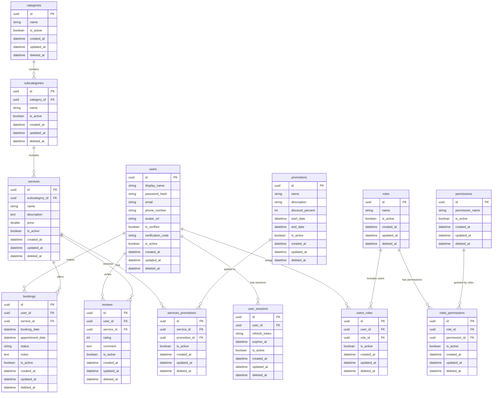

# T-BEAUTI-CENTER ([REF](https://vienthammydiva.vn/))

website to book spa care appointments

```mermaid
%%{init: {
  "theme": "default",
  "themeCSS": [
    ".er.relationshipLabel { fill: black; }",
    ".er.relationshipLabelBox { fill: white; }",
    "[id^=entity-users] .er.entityBox { fill: #4d9a00; }",
    "[id^=entity-user_sessions] .er.entityBox { fill: #4d9a00; }",
    "[id^=entity-roles] .er.entityBox { fill: #4d9a00; }",
    "[id^=entity-permissions] .er.entityBox { fill: #4d9a00; }",
    "[id^=entity-roles_permissions] .er.entityBox { fill: #4d9a00; }",
    "[id^=entity-users_roles] .er.entityBox { fill: #4d9a00; }",
    "[id^=entity-categories] .er.entityBox { fill: #4d9a00; }",
    "[id^=entity-subcategories] .er.entityBox { fill: #4d9a00; }",
    "[id^=entity-services] .er.entityBox { fill: #4d9a00; }",
    "[id^=entity-bookings] .er.entityBox { fill: #4d9a00; }",
    "[id^=entity-promotions] .er.entityBox { fill: #4d9a00; }",
    "[id^=entity-services_promotions] .er.entityBox { fill: #4d9a00; }",
    "[id^=entity-reviews] .er.entityBox { fill: #4d9a00; }"
  ]
}}%%

erDiagram
    users {
        uuid id PK
        string display_name
        string password_hash
        string email
        string phone_number
        string avatar_url
        boolean is_verified
        string verification_code
        boolean is_active
        datetime created_at
        datetime updated_at
        datetime deleted_at
    }

    user_sessions {
        uuid id PK
        uuid user_id FK
        string refresh_token
        datetime expires_at
        boolean is_active
        datetime created_at
        datetime updated_at
        datetime deleted_at
    }

    roles {
        uuid id PK
        string name
        boolean is_active
        datetime created_at
        datetime updated_at
        datetime deleted_at
    }

    permissions {
        uuid id PK
        string permission_name
        boolean is_active
        datetime created_at
        datetime updated_at
        datetime deleted_at
    }

    roles_permissions {
        uuid id PK
        uuid role_id FK
        uuid permission_id FK
        boolean is_active
        datetime created_at
        datetime updated_at
        datetime deleted_at
    }

    users_roles {
        uuid id PK
        uuid user_id FK
        uuid role_id FK
        boolean is_active
        datetime created_at
        datetime updated_at
        datetime deleted_at
    }

    categories {
        uuid id PK
        string name
        boolean is_active
        datetime created_at
        datetime updated_at
        datetime deleted_at
    }

    subcategories {
        uuid id PK
        uuid category_id FK
        string name
        boolean is_active
        datetime created_at
        datetime updated_at
        datetime deleted_at
    }

    services {
        uuid id PK
        uuid subcategory_id FK
        string name
        text description
        double price
        boolean is_active
        datetime created_at
        datetime updated_at
        datetime deleted_at
    }

    bookings {
        uuid id PK
        uuid user_id FK
        uuid service_id FK
        datetime booking_date
        datetime appointment_date
        string status
        text notes
        boolean is_active
        datetime created_at
        datetime updated_at
        datetime deleted_at
    }

    promotions {
        uuid id PK
        string name
        string description
        int discount_percent
        datetime start_date
        datetime end_date
        boolean is_active
        datetime created_at
        datetime updated_at
        datetime deleted_at
    }

    services_promotions {
        uuid id PK
        uuid service_id FK
        uuid promotion_id FK
        boolean is_active
        datetime created_at
        datetime updated_at
        datetime deleted_at
    }

    reviews {
        uuid id PK
        uuid user_id FK
        uuid service_id FK
        int rating
        text comment
        boolean is_active
        datetime created_at
        datetime updated_at
        datetime deleted_at
    }

    users ||--o{ user_sessions : "has sessions"
    users ||--o{ users_roles : "assigned to"
    roles ||--o{ users_roles : "includes users"
    roles ||--o{ roles_permissions : "has permissions"
    permissions ||--o{ roles_permissions : "granted by roles"
    users ||--o{ bookings : "makes"
    users ||--o{ reviews : "writes"
    categories ||--o{ subcategories : "contains"
    subcategories ||--o{ services : "includes"
    services ||--o{ bookings : "offers"
    services ||--o{ reviews : "receives"
    services ||--o{ services_promotions : "has"
    promotions ||--o{ services_promotions : "applies to"

```
